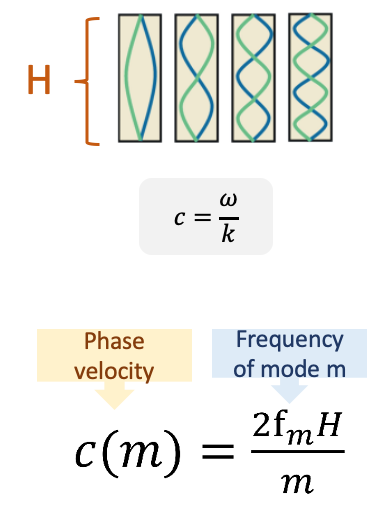

# Extracting phase velocity using normal-mode analysis

The jupyter notebook **estimate_velocities.ipynb** shows an example to extract phase velocity for a wave trapped in the borehole using normal-mode analysis (Chang & Nakata, 2022[^1]). The wave is observed on the DAS (Distributed Acoustic Sensing) install in a vertical borehole at the Brady geothermal field in Nevada. 

We pick the amplitude peaks of the normal-modes in the frequency-space domain. Then, we calculate phase velocity using the following equation, assuming the wave trapped on a string with closed boundaries:

**Content description:**

- *estimate_velocities.ipynb*: 
The notebook that explain the methods.

- *Brady_processing.py*:
Processing utility functions.

- *ccf/*: 
A folder stores the spectrograms used to pick the maximum frequencies.

- *fls_list_v1.npy*: 
The picked maximum frequencies for the first 5 modes for 8 days.

- *nms_list_v4.npy*: 
The shape of the modes at these maximum frequencies.

- *requirements.txt*: 
Python library requirements.

[^1]: Chang, H., & Nakata, N. (2022). Investigation of Time-Lapse Changes with DAS Borehole Data at the Brady Geothermal Field Using Deconvolution Interferometry. Remote Sensing, 14(1), 185.

